# README.md

# Prerequisite →
	1. Only thing that you need is the aws account and also you need to know some basics of it
	2. Than we configure Terraform inside an ec2 instance
	3. we also need an IAM ec2 role that provide necessary permission to ec2
    4. I worken on aws-ec2

# Completion steps →
Step 1 → Login and basics setup
Step 2 → Setup Docker ,Terraform ,aws cli , and Kubectl
Step 3 → IAM Role for EC2
Step 4 →Attach IAM role with your EC2
Step 5 → Building Infrastructure Using terraform
Step 6 → Creation of deployment and service for EKS
Step 7 → Destroy all the Insrastructure
Let’s do it
Step 1 → Login and basics setup
	1. login into your aws account as a root user

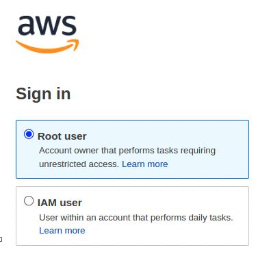
2. Launch an EC2 instance with the following setting

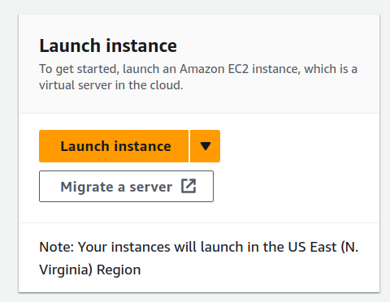
		
		
		
		
		
		
		allow https,http and set a key pair
3. Click on launch Instance

click on connect on the top right corner
4. click on connect and you are connected with your machine
		
		
		
5. run the following commands
a. sudo su
b. apt update -y
Step 2 → Setup Docker ,Terraform ,aws cli , and Kubectl
Setup Docker → click on me to know basics of docker
	1. apt install docker.io

2. usermod -aG docker $USER # Replace with your username e.g ‘ubuntu’
3. newgrp docker
Setup Terraform → click on me to know basics of terraform
	1. sudo apt install wget -y
	2. wget -O-  https://apt.releases.hashicorp.com/gpg | sudo gpg — dearmor -o /usr/share/keyrings/hashicorp-archive-keyring.gpg
echo “deb [signed-by=/usr/share/keyrings/hashicorp-archive-keyring.gpg] https://apt.releases.hashicorp.com $(lsb_release -cs) main” | sudo tee /etc/apt/sources.list.d/hashicorp.list
	3. sudo apt update && sudo apt install terraform -y

Setup AWS cli
Aws using your computer’s command lines instead of clicking around on a website. It helps you do things like telling AWS to create or manage stuff, all by typing commands in a special language your computer understands. It’s like giving orders to AWS with your keyboard instead of a mouse.
	1. curl “ https://awscli.amazonaws.com/awscli-exe-linux-x86_64.zip" -o “awscliv2.zip”
	2. sudo apt-get install unzip -y
	3. unzip awscliv2.zip
	4. sudo ./aws/install
Setup kubectl → click on me to know basics of kubernetes
	1. sudo apt install curl -y
	2. curl -LO  https://dl.k8s.io/release/$(curl -L -s  https://dl.k8s.io/release/stable.txt)/bin/linux/amd64/kubectl
	3. sudo install -o root -g root -m 0755 kubectl /usr/local/bin/kubectl
		
		
		
Every thing is setup and installed let’s make a IAM EC2 Role
Step 3 → IAM Role for EC2
Why we need IAM role for EC2 → It is used by your ec2 instance to create EKS cluster and manage s3 bucket by applying this IAM role it gives the authenticity to your ec2 to do changes in aws account
	1. on the search bar type IAM

2. click on Roles on the left side

3. click on create role and choose EC2 from the dropdown

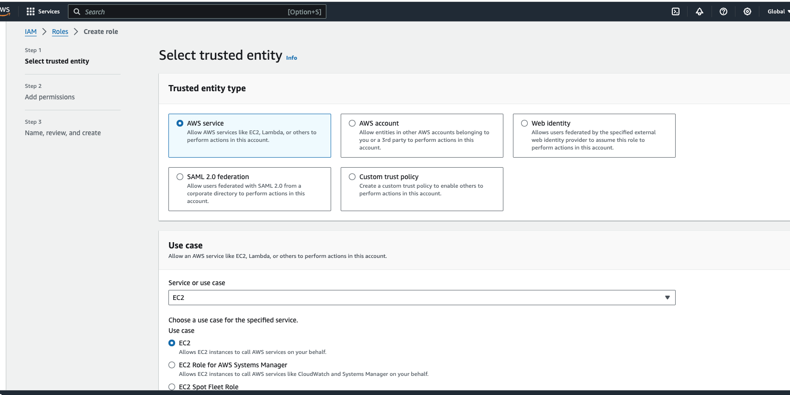

4. click on next
5. choose administrator access on permission sections
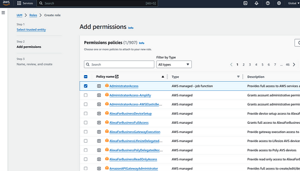
6. click on next and give a name to your role

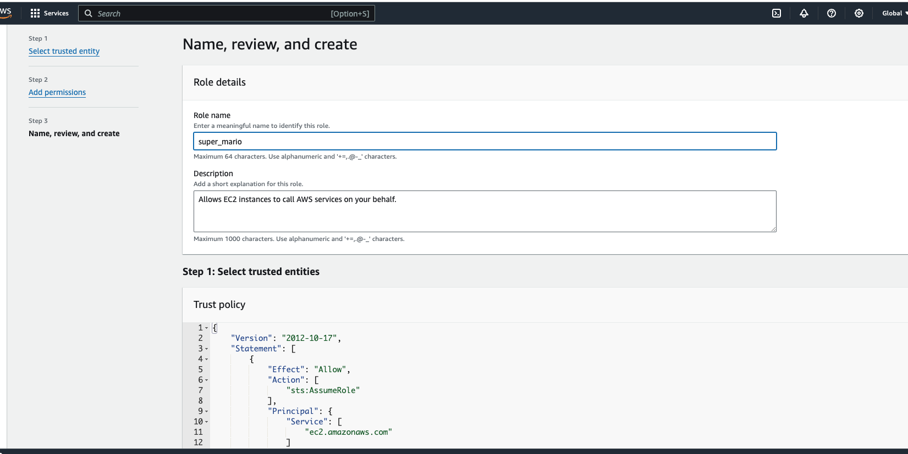

7. click on create role option and your IAM role is created

Step 4 →Attach IAM role with your EC2
	1. go to EC2 section
	2. click on actions → security → modify IAM role option

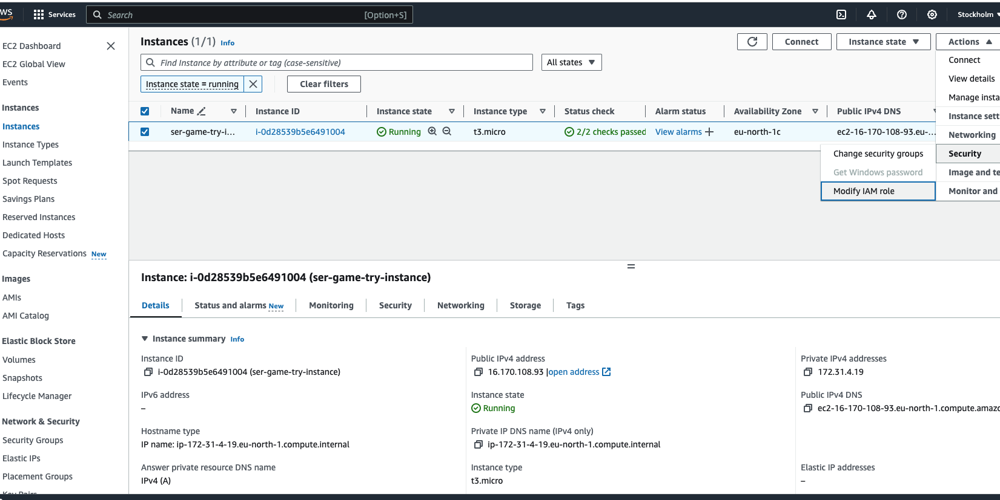
3. choose the role from dropdown and click on update IAM role

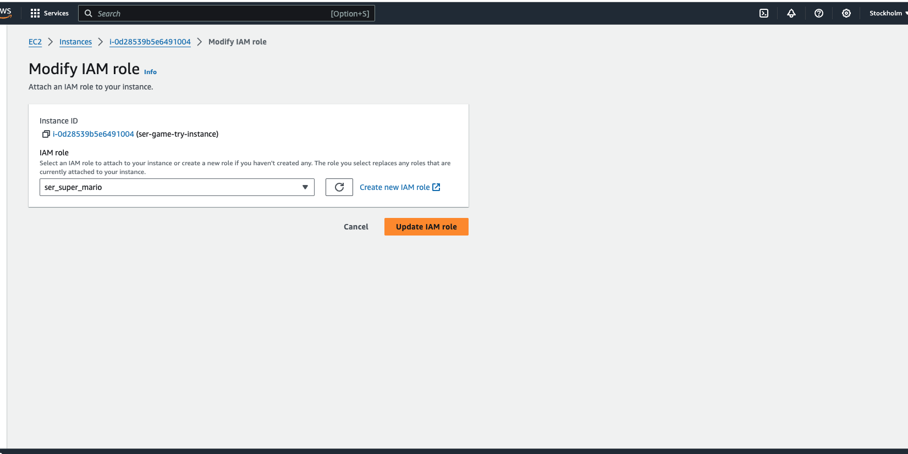

why we need IAM Role →
Imagine you have a robot (EC2 instance) that does tasks for you in a big factory (AWS environment). Now, this robot needs to access different rooms (AWS services like S3, DynamoDB, etc.) to perform its tasks.
Here’s where IAM (Identity and Access Management) comes in:
	1. Robot Needs a Key to Enter Rooms: The IAM Role is like giving your robot a special key. This key allows the robot to enter specific rooms (access certain AWS services). Without this key, the robot can’t get in.
	2. Different Keys for Different Robots: Each robot (EC2 instance) can have its own key (IAM Role) with specific permissions. So, one robot may have a key to enter the storage room (access S3), while another robot has a key to enter the database room (access DynamoDB).
	3. No Need for Hardcoding Passwords: Using IAM Roles means you don’t have to hardcode passwords (access credentials) into the robot. It’s like not writing down passwords on the robot itself. The robot just uses its key when needed.
	4. Easily Change Permissions: If you want to change what a robot can do, you just change the permissions on its key (IAM Role). No need to reprogram the robot or give it a new password; just update the permissions on its key.
	5. Secure and Controlled Access: IAM Roles help keep things secure. You can control exactly what each robot is allowed to do. This way, if one robot is compromised or needs a different role, you can easily adjust its permissions without affecting others.
Now everything is done what we have to do is just throw and some commands and build our infrastructure using terraform to run super mario
Step 5 → Building Infrastructure Using terraform

1. clone the github repo 
a. mkdir super_mario
b. cd super_mario
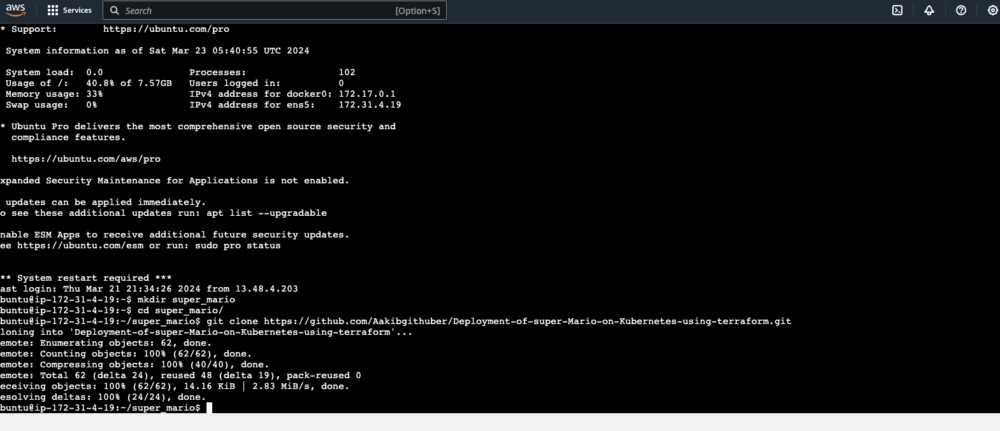
c.Thank you for @Aakibgithuber guidance and explanations during the project phase.
c. cd Deployment-of-super-Mario-on-Kubernetes-using-terraform/

e. cd EKS-TF

f. edit the backend.tf file by → vim backend.tf

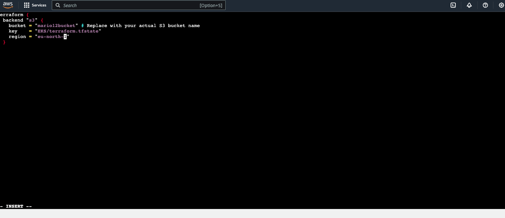

Note →make sure to provide your bucket and region name in this file otherwise it doesn’t work and IAM role is also associated with your ec2 which helps ec2 to use other services such S3 bucket
NOW RUN →
	1. terraform init

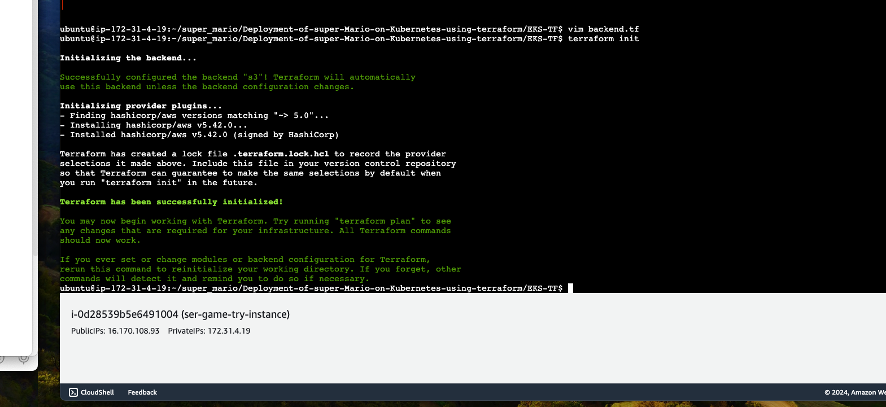

When we run terraform init, it sets up your working area, downloads necessary plugins, and makes sure everything is in place so that you can start using Terraform to create, update, or manage your infrastructure. It's like getting all the tools and materials ready before you start building something amazing with your computer.
2. terraform validate

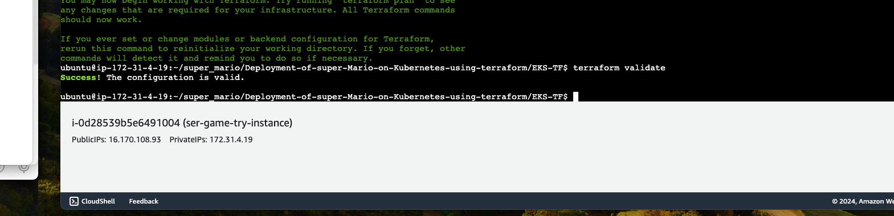

3-terraform plan

Terraform plan is used to see what changes will be made to your infrastructure. By using this command we could review and confirm that everything looks good before giving the final approval to build or modify our application infrasructure It is like the blueprint of the construction project before actually creating or changing anything with Terraform

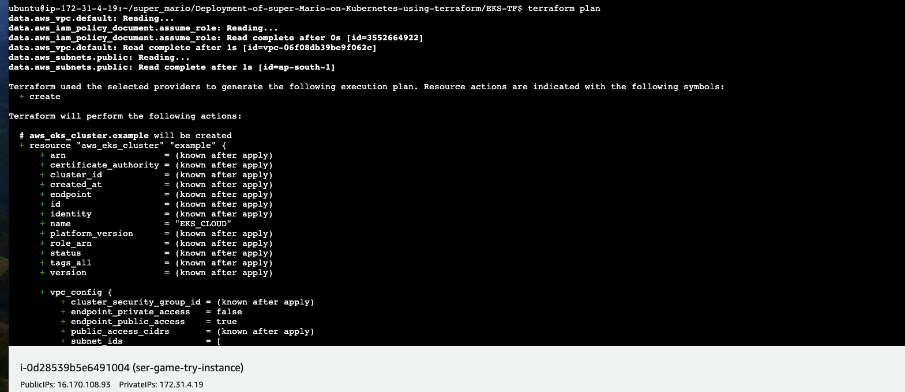

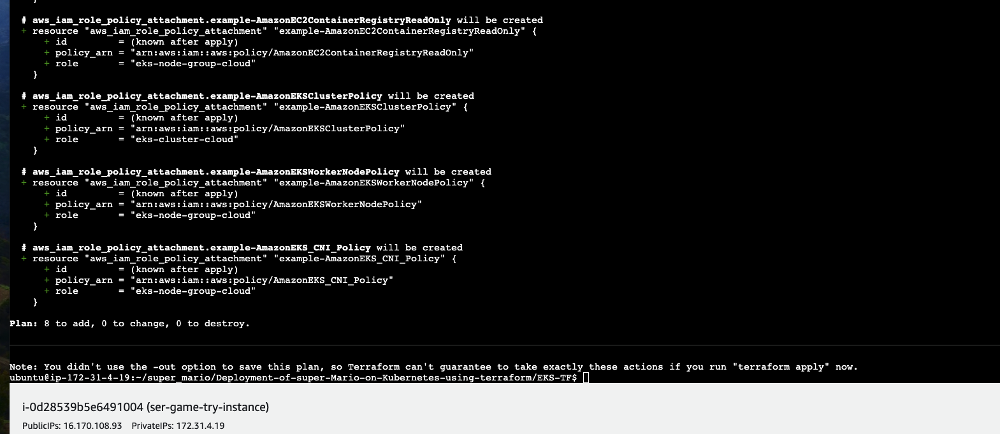

4. terraform apply
terraform apply --auto-approve
Running terraform apply --auto-approve is like telling computer, "Go ahead and build everything exactly as planned without asking me for confirmation each time." It's a way to automate the deployment of your infrastructure without needing our constant input. When we execute this command, Terraform reads our code, figures out what needs to be created or changed, and then goes ahead with the construction, skipping the usual step where it checks with you for approval.

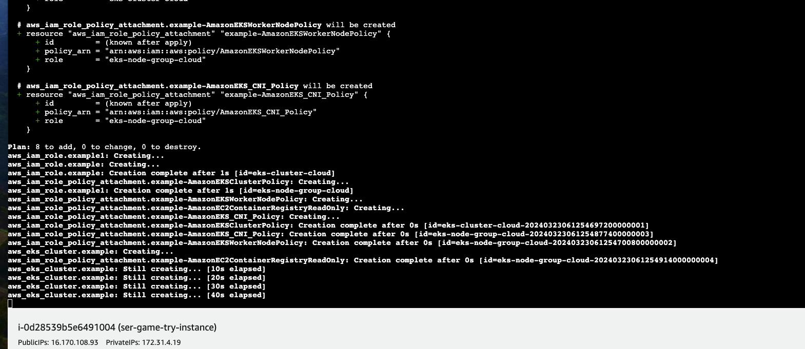

It takes your 5 to 10 min for completion
5. Below command is used to update the configuration of EKS
aws eks update-kubeconfig --name EKS_CLOUD --region eu-north-1

The command aws eks update-kubeconfig --name EKS_CLOUD --region us-east-1 is like telling our computer, "Hey, I'm using Amazon EKS (Elastic Kubernetes Service) in the 'us-east-1' region, and I want to connect to it. you could use your desired location

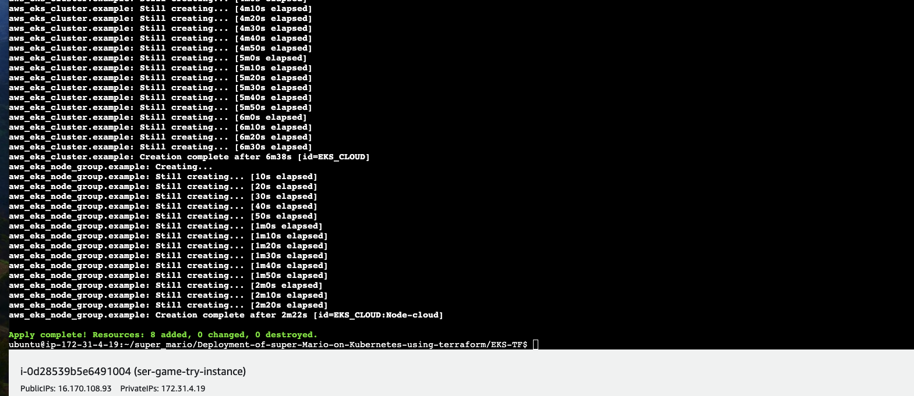

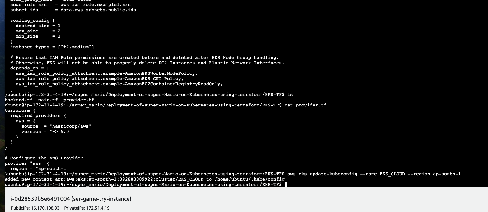

Step 6 → Creation of deployment and service for EKS
	1. change the directory where deployment and service files are stored use the command → cd ..
	2. create the deployment
kubectl apply -f deployment.yaml 

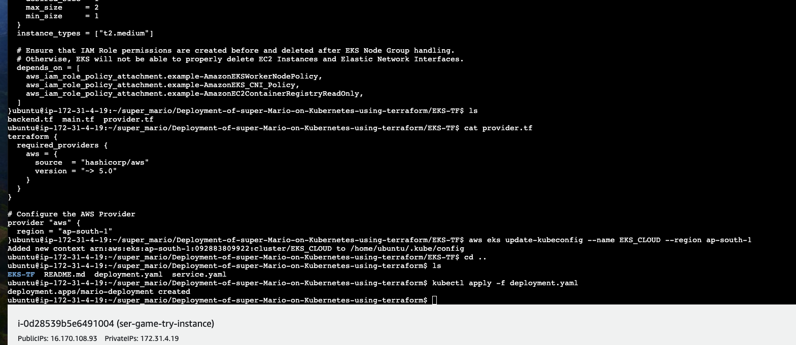

deployment.yaml file is like a set of instructions that tells a computer system, "Hey, here's how you should run and manage a particular application " . It provides the necessary information for a computer system to deploy and manage a specific software application. It includes details like what the application is, how many copies of it should run, and other settings that help the system understand how to keep the application up and running smoothly.
3. Now create the service
kubectl apply -f service.yaml

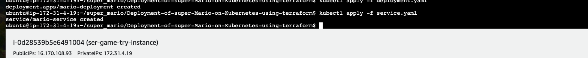

service.yaml file is like a set of rules that helps computers find and talk to each other within a software application. It's like a directory that says, "Hey, this is how you can reach different parts of our application." It specifies how different parts of your application communicate and how other services or users can connect to them.
4. run → kubectl get all

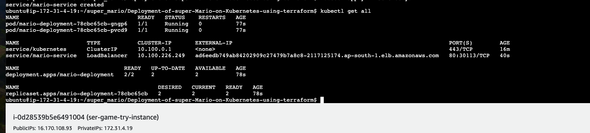

5. now Run the follwing command to get the load balancer ingress
This command tells all the details of your application
kubectl describe service mario-service

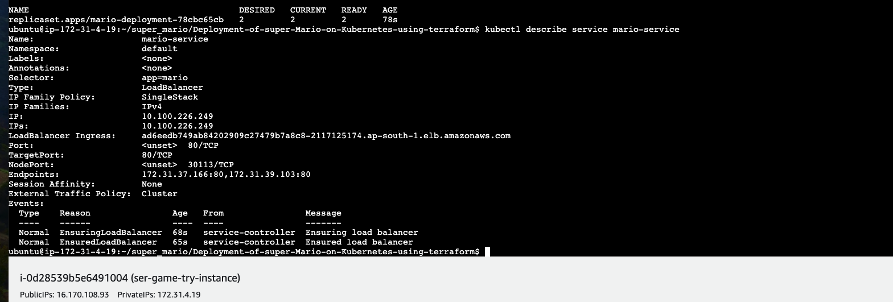

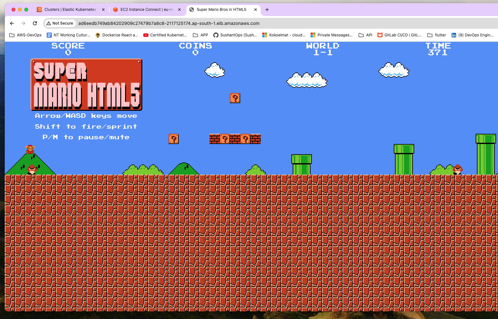

Play and Enjoy but don’t forget to destroy everything that’s saves of aws bill and you aws account too
Load Balancer Ingress →
It is a mechanism that helps distribute incoming internet traffic among multiple servers or services, ensuring efficient and reliable delivery of requests.
It’s like having a receptionist at a busy office building entrance who guides visitors to different floors or departments, preventing overcrowding at any one location. In the digital world, a Load Balancer Ingress helps maintain a smooth user experience, improves application performance, and ensures that no single server becomes overwhelmed with too much traffic.

Step 7 → Destroy all the Infrastructure
1 . Below commands delete your deployment and service

* kubectl delete service mario-service

* kubectl delete deployment mario-deployment

2. After service and deployment destruction let’s destroy the infrastructure by the following command it will delete your EKS cluster

